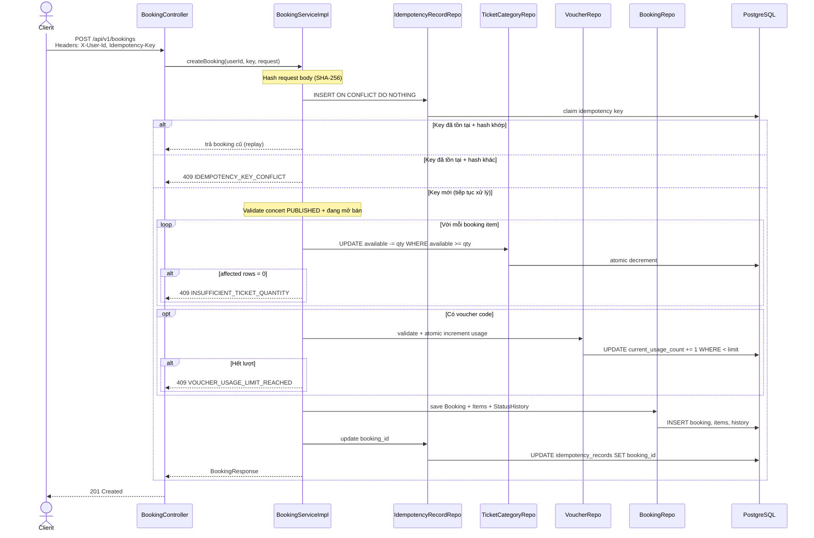

# Booking Sequence Diagram

```mermaid
sequenceDiagram
    actor Client
    participant Controller as BookingController
    participant Service as BookingServiceImpl
    participant IdempRepo as IdempotencyRecordRepo
    participant TicketRepo as TicketCategoryRepo
    participant VoucherRepo as VoucherRepo
    participant BookingRepo as BookingRepo
    participant DB as PostgreSQL

    Client->>Controller: POST /api/v1/bookings<br/>Headers: X-User-Id, Idempotency-Key

    Controller->>Service: createBooking(userId, key, request)

    Note over Service: Hash request body (SHA-256)

    Service->>IdempRepo: INSERT ON CONFLICT DO NOTHING
    IdempRepo->>DB: claim idempotency key

    alt Key đã tồn tại + hash khớp
        Service-->>Controller: trả booking cũ (replay)
    else Key đã tồn tại + hash khác
        Service-->>Controller: 409 IDEMPOTENCY_KEY_CONFLICT
    else Key mới (tiếp tục xử lý)
        Note over Service: Validate concert PUBLISHED + đang mở bán

        loop Với mỗi booking item
            Service->>TicketRepo: UPDATE available -= qty WHERE available >= qty
            TicketRepo->>DB: atomic decrement
            alt affected rows = 0
                Service-->>Controller: 409 INSUFFICIENT_TICKET_QUANTITY
            end
        end

        opt Có voucher code
            Service->>VoucherRepo: validate + atomic increment usage
            VoucherRepo->>DB: UPDATE current_usage_count += 1 WHERE < limit
            alt Hết lượt
                Service-->>Controller: 409 VOUCHER_USAGE_LIMIT_REACHED
            end
        end

        Service->>BookingRepo: save Booking + Items + StatusHistory
        BookingRepo->>DB: INSERT booking, items, history

        Service->>IdempRepo: update booking_id
        IdempRepo->>DB: UPDATE idempotency_records SET booking_id

        Service-->>Controller: BookingResponse
    end

    Controller-->>Client: 201 Created
```
