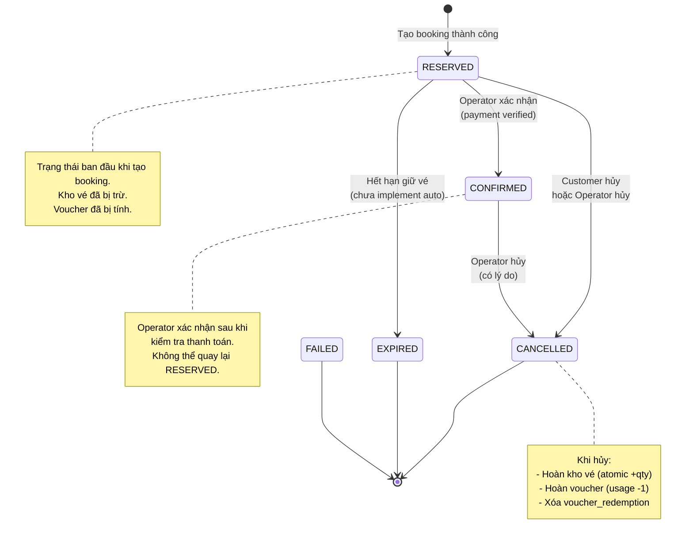

# Booking State Machine

## Chuyển trạng thái hợp lệ

| Từ | Sang | Ai được phép |
|---|---|---|
| (mới tạo) | RESERVED | System (khi tạo booking) |
| RESERVED | CONFIRMED | Operator |
| RESERVED | CANCELLED | Customer hoặc Operator |
| RESERVED | EXPIRED | System (scheduled, chưa implement) |
| CONFIRMED | CANCELLED | Operator (kèm lý do) |

Chuyển trạng thái không nằm trong bảng trên → bị chặn với **409 INVALID_BOOKING_STATUS_TRANSITION**.
