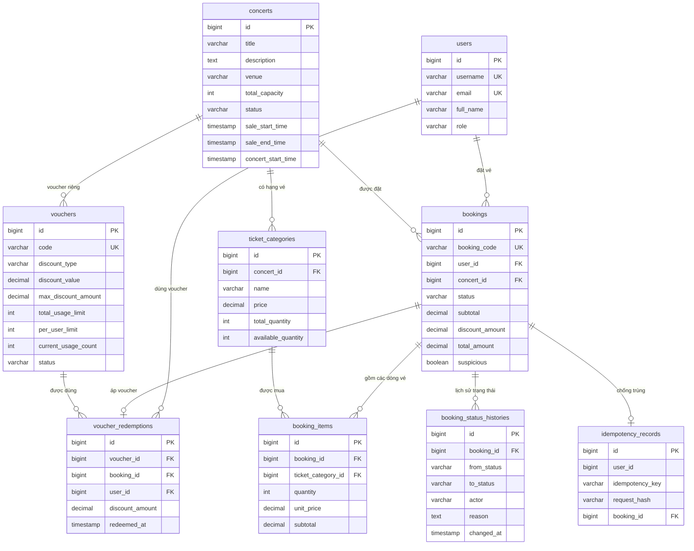

# Database ERD

```mermaid
erDiagram
    users ||--o{ bookings : "đặt vé"
    users ||--o{ voucher_redemptions : "dùng voucher"
    concerts ||--o{ ticket_categories : "có hạng vé"
    concerts ||--o{ bookings : "được đặt"
    concerts ||--o{ vouchers : "voucher riêng"
    bookings ||--o{ booking_items : "gồm các dòng vé"
    bookings ||--o| voucher_redemptions : "áp voucher"
    bookings ||--o{ booking_status_histories : "lịch sử trạng thái"
    bookings ||--o| idempotency_records : "chống trùng"
    ticket_categories ||--o{ booking_items : "được mua"
    vouchers ||--o{ voucher_redemptions : "được dùng"

    users {
        bigint id PK
        varchar username UK
        varchar email UK
        varchar full_name
        varchar role
    }

    concerts {
        bigint id PK
        varchar title
        text description
        varchar venue
        int total_capacity
        varchar status
        timestamp sale_start_time
        timestamp sale_end_time
        timestamp concert_start_time
    }

    ticket_categories {
        bigint id PK
        bigint concert_id FK
        varchar name
        decimal price
        int total_quantity
        int available_quantity
    }

    bookings {
        bigint id PK
        varchar booking_code UK
        bigint user_id FK
        bigint concert_id FK
        varchar status
        decimal subtotal
        decimal discount_amount
        decimal total_amount
        boolean suspicious
    }

    booking_items {
        bigint id PK
        bigint booking_id FK
        bigint ticket_category_id FK
        int quantity
        decimal unit_price
        decimal subtotal
    }

    vouchers {
        bigint id PK
        varchar code UK
        varchar discount_type
        decimal discount_value
        decimal max_discount_amount
        int total_usage_limit
        int per_user_limit
        int current_usage_count
        varchar status
    }

    voucher_redemptions {
        bigint id PK
        bigint voucher_id FK
        bigint booking_id FK
        bigint user_id FK
        decimal discount_amount
        timestamp redeemed_at
    }

    idempotency_records {
        bigint id PK
        bigint user_id
        varchar idempotency_key
        varchar request_hash
        bigint booking_id FK
    }

    booking_status_histories {
        bigint id PK
        bigint booking_id FK
        varchar from_status
        varchar to_status
        varchar actor
        text reason
        timestamp changed_at
    }
```
