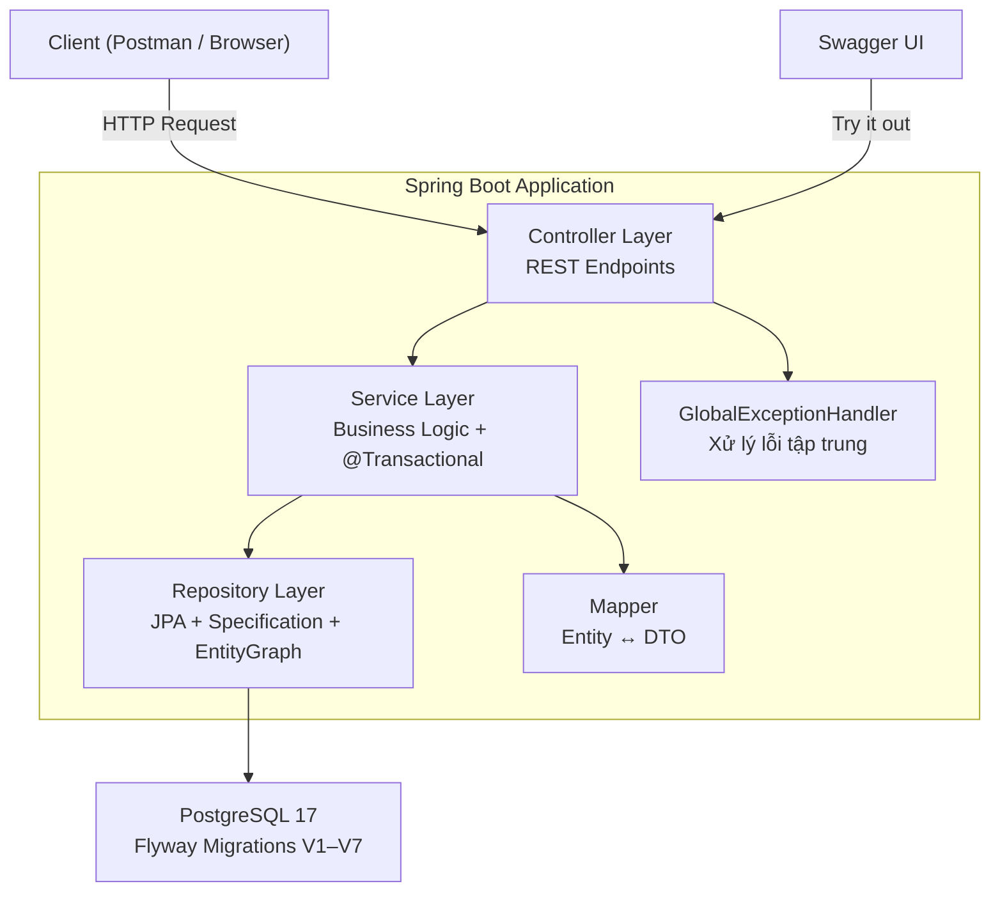

# Kiến trúc hệ thống

```mermaid
graph TB
    Client["Client (Postman / Browser)"]
    Swagger["Swagger UI"]

    subgraph "Spring Boot Application"
        Controller["Controller Layer<br/>REST Endpoints"]
        Service["Service Layer<br/>Business Logic + @Transactional"]
        Repository["Repository Layer<br/>JPA + Specification + EntityGraph"]
        Mapper["Mapper<br/>Entity ↔ DTO"]
        ErrorHandler["GlobalExceptionHandler<br/>Xử lý lỗi tập trung"]
    end

    DB["PostgreSQL 17<br/>Flyway Migrations V1–V7"]

    Client -->|HTTP Request| Controller
    Swagger -->|Try it out| Controller
    Controller --> Service
    Service --> Repository
    Service --> Mapper
    Controller --> ErrorHandler
    Repository --> DB
```
