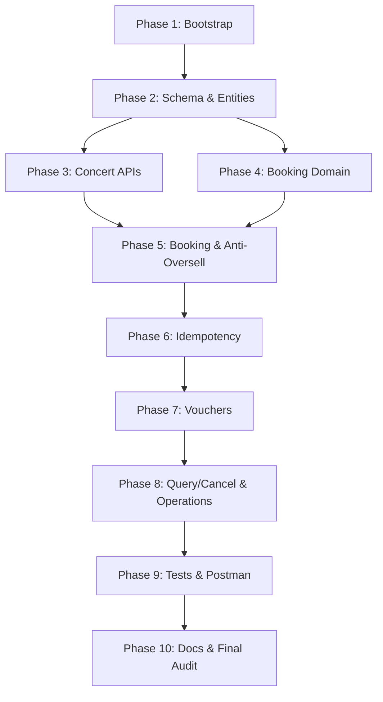

# GeekTicket – Repository Audit & Implementation Plan

> Generated: 2026-08-04 | Checklist: `GeekTicket_Assessment_Checklist_Gradle.md`

---

## 1. Current State

### 1.1 Build System

| Item | Current | Target | Status |
|---|---|---|---|
| Build tool | Gradle 9.5.1 Kotlin DSL | Gradle Wrapper | ✅ OK |
| Spring Boot | 4.1.0 | Spring Boot | ✅ OK |
| Java | 21 (toolchain) | 21 | ✅ OK |
| `settings.gradle.kts` | `rootProject.name = "geekticket"` | — | ✅ OK |

### 1.2 Dependencies (build.gradle.kts)

| Dependency | Status | Action |
|---|---|---|
| `spring-boot-starter-webmvc` | ✅ | — |
| `spring-boot-starter-data-jpa` | ✅ | — |
| `spring-boot-starter-validation` | ✅ | — |
| `spring-boot-starter-actuator` | ✅ | — |
| `spring-boot-starter-flyway` | ✅ | — |
| `lombok` | ✅ | — |
| `spring-boot-devtools` | ✅ | — |
| **`flyway-mysql`** | ❌ WRONG | Replace → `flyway-database-postgresql` |
| **`mysql-connector-j`** | ❌ WRONG | Replace → `org.postgresql:postgresql` |
| **springdoc-openapi** | ❌ MISSING | Add `springdoc-openapi-starter-webmvc-ui` |
| **Testcontainers** | ❌ MISSING | Add `spring-boot-testcontainers` + `testcontainers-postgresql` |
| `spring-boot-starter-*-test` (lines 31-35) | ❌ INVALID | These starters don't exist. Replace all with `spring-boot-starter-test` |

### 1.3 Configuration

| File | Status |
|---|---|
| `application.properties` | Only `spring.application.name=geekticket` |
| `application.yml` / `application-local.yml` | ❌ MISSING |
| JPA ddl-auto | Not set (must be `validate`) |
| Flyway | Not configured |
| Jackson/UTC | Not configured |
| Swagger metadata | Not configured |

### 1.4 Infrastructure

| File | Status |
|---|---|
| Dockerfile | ❌ MISSING |
| docker-compose.yml | ❌ MISSING |
| .env.example | ❌ MISSING |
| .dockerignore | ❌ MISSING |

### 1.5 Package Structure

64 Java files exist — **all empty stubs** (only `package` declaration, ~37-46 bytes each).

**Matches checklist §5 required structure** except:
- `event/` package exists (3 files) — **out of scope** per checklist §2.2

### 1.6 Flyway Migrations

`src/main/resources/db/migration/` exists but is **empty**.

### 1.7 Tests

Only `GeekticketApplicationTests.java` with `contextLoads()` — **fails** (no datasource).

### 1.8 Build Result

```
Command: .\gradlew.bat clean build --no-daemon

> Task :compileJava             ✅ SUCCESS
> Task :bootJar                 ✅ SUCCESS
> Task :compileTestJava         ✅ SUCCESS
> Task :test                    ❌ FAILED
  GeekticketApplicationTests > contextLoads() FAILED
    Caused by: DataSourceProperties$DataSourceBeanCreationException

BUILD FAILED in 29s (compilation OK, test fails — no DB config)
```

```
Command: .\gradlew.bat clean classes testClasses --no-daemon

BUILD SUCCESSFUL in 21s (compilation-only passes)
```

---

## 2. Blocking Issues

| # | Issue | Severity | Resolution |
|---|---|---|---|
| B1 | MySQL deps instead of PostgreSQL | 🔴 BLOCKER | Replace flyway-mysql + mysql-connector-j |
| B2 | No PostgreSQL config | 🔴 BLOCKER | Create application.yml |
| B3 | No Flyway migrations | 🔴 BLOCKER | Create V1–V3 SQL files |
| B4 | No Docker infrastructure | 🔴 BLOCKER | Create Dockerfile + compose + .env |
| B5 | Invalid test starters | 🔴 BLOCKER | Replace with spring-boot-starter-test |
| B6 | Missing springdoc-openapi | 🟡 HIGH | Add dependency |
| B7 | Missing Testcontainers | 🟡 HIGH | Add dependencies |
| B8 | No UTC/Jackson config | 🟡 HIGH | Configure in application.yml |

### Other Issues

| # | Issue | Severity |
|---|---|---|
| M1 | `event/` package (out of scope) | 🟠 MEDIUM — leave empty or remove |
| M2 | `SecurityConfig.java` (no Spring Security dep) | 🟠 MEDIUM — repurpose as CORS |

---

## 3. Target State

Per checklist §§4,15,16:

- `docker compose up --build` → PostgreSQL + app running
- `GET /actuator/health` → `{"status":"UP"}`
- Swagger UI at `/swagger-ui.html`
- Flyway V1–V3 applied (schema, indexes, seed)
- JPA ddl-auto=validate
- UTC timestamps, BigDecimal money
- All checklist §8 APIs implemented
- All checklist §12 tests passing
- Postman collection + environment
- Full documentation suite per checklist §14

---

## 4. Implementation Phases

### Phase 1: Bootstrap & Infrastructure (Checklist §§4,15,17.2)

**Depends on:** —  
**Work:** Fix deps, config, Docker, error infrastructure, OpenAPI config, fix test  
**DoD:** docker compose up works, health UP, Swagger loads, `gradlew test` passes

### Phase 2: Schema, Entities & Repositories (Checklist §§6,17.3 partial)

**Depends on:** Phase 1  
**Work:** V1-V3 migrations, 9 entities, 5 enums, 9 repositories, repo integration tests  
**DoD:** Flyway V1-V3 applied, seed data exists, ddl-auto=validate passes

### Phase 3: Concert & Ticket Category APIs (Checklist §§8.1,8.2 partial,17.3)

**Depends on:** Phase 2  
**Work:** Concert DTOs, mappers, services, controllers, Swagger, tests  
**DoD:** Customer list/detail, operator create/publish all working

### Phase 4: Booking Domain & Price Calculation (Checklist §§7,9 partial,17.4 partial)

**Depends on:** Phase 2  
**Work:** State machine, BookingCodeGenerator, price calc, DTOs, unit tests  
**DoD:** Transition tests pass, price calc tests pass

### Phase 5: Core Booking & Overselling Protection (Checklist §§9,10.1,12.2,12.3)

**Depends on:** Phase 3 + Phase 4  
**Work:** POST /bookings, atomic inventory, concurrency test (50 threads/10 tickets)  
**DoD:** Concurrency test passes, multi-item rollback works

### Phase 6: Idempotency (Checklist §§10.2,12.3)

**Depends on:** Phase 5  
**Work:** Idempotency-Key header, request hash, INSERT ON CONFLICT, replay/conflict tests  
**DoD:** Same key → same booking, different payload → 409, concurrent same-key → 1 booking

### Phase 7: Voucher Integration (Checklist §§10.3,12.3,17.5)

**Depends on:** Phase 6  
**Work:** Voucher validation chain, atomic used_count, discount calc, concurrency test  
**DoD:** All validation cases pass, last-voucher concurrency passes, rollback works

### Phase 8: Customer Query/Cancel & Operations (Checklist §§8.1,8.2,17.6)

**Depends on:** Phase 7  
**Work:** GET /bookings/{code}, POST cancel, operation list/filter/detail/status-update  
**DoD:** Owner-only access, inventory restore once, status history with actor

### Phase 9: Test Suite & Postman (Checklist §§12,13,17.7)

**Depends on:** Phase 8  
**Work:** Fill test gaps, Postman collection + environment, run 2x for flaky detection  
**DoD:** 3 concurrency tests, full suite passes 2x, Postman collection importable

### Phase 10: Documentation & Final Audit (Checklist §§14,16,17.8,18)

**Depends on:** Phase 9  
**Work:** README, CONTRIBUTING, design docs, diagrams, technical report, final audit  
**DoD:** Clean clone → docker → test reproducible, no false claims

---

## 5. Dependency Graph



---

## 6. Risk Register

| # | Risk | Impact | Mitigation |
|---|---|---|---|
| R1 | Spring Boot 4.1.0 starter name changes | Medium | Verify each starter exists before adding |
| R2 | Testcontainers on Windows Docker Desktop | High | Test early in Phase 1; use @ServiceConnection |
| R3 | Invalid test starters cause resolution errors | High | Replace immediately in Phase 1 |
| R4 | Concurrency tests flaky | High | Use CyclicBarrier, no Thread.sleep |
| R5 | `event/` package scope creep | Low | Leave empty; document as out-of-scope |
| R6 | Time pressure (10 phases) | High | Prioritize Phases 1–7 (core value) |

---

## 7. Out-of-Scope (Confirmed per Checklist §2.2)

Frontend, payment gateway, seat selection, email/SMS, refund, OAuth2/JWT, voucher CRUD, auto fraud detection, cloud deployment, microservices, Kafka/RabbitMQ, Redis.

---

## 8. Commands Executed

| Command | Result |
|---|---|
| `.\gradlew.bat clean build --no-daemon` | Compile ✅, test ❌ (no datasource) |
| `.\gradlew.bat clean classes testClasses --no-daemon` | BUILD SUCCESSFUL |

## 9. Changed Files

| File | Purpose |
|---|---|
| `docs/implementation-plan.md` | This document |
| `docs/implementation-progress.md` | Checklist progress tracker |

No business code created or modified.
